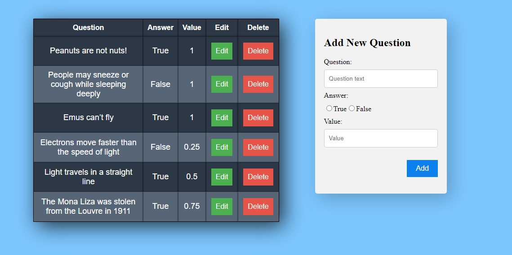
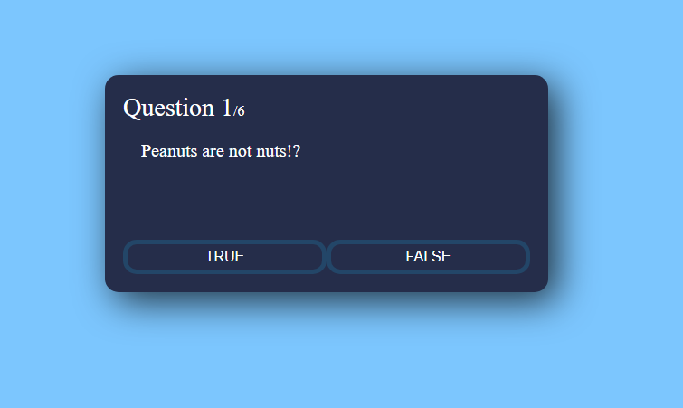

# Questionnaire App

> Questionnaire app for creating questionnaires and quizzes.

## Built With

- React
- RTK Query
- NodeJS
- Express
- Mongoose

## Getting Started
To get a local copy up and running follow these simple example steps.

- Click on the top right green "code" button.
- On the dropdown menu, choose "download with zip" button.
- After download, extract the zip file and you have the project on your machine.
- Open terminal on the server folder and run `npm i` to install all packages for back-end and run `npm start`.
- Open terminal on the client folder and run `npm i` to install all packages for front-end and run `npm start`.

## Author

👤 **Kerolous Samy**

- GitHub: [@keroloussamy](https://github.com/keroloussamy)
- Twitter: [@keroloussamy](https://twitter.com/kerolous_samy)
- LinkedIn: [keroloussamy](https://www.linkedin.com/in/keroloussamy/)

## 🤝 Contributing

Contributions, issues, and feature requests are welcome!

Feel free to check the [issues page](../../issues/).

## Show your support

Give a ⭐️ if you like this project!

## 📝 License

This project is [MIT](./MIT.md) licensed.
